## What's this?
- Instructions how to setup OpenVINO(TM) enviornment on Microsoft VS Code on Windows PC (Intel(r) Core Ultra)
- Goal is to run [OpenVINO(TM) Notebooks](https://github.com/openvinotoolkit/openvino_notebooks/tree/latest) sample scripts with CPU/GPU/NPU on your VS code. 

## First to do when you get PC
- please update GPU and CPU driver
- https://www.intel.co.jp/content/www/jp/ja/products/details/processors/core-ultra/downloads.html
  - インテル® Arc™ & Iris® Xe Graphics - Windows*
  - インテル® NPU ドライバー - Windows*
- Also run Windows Update
  - 設定　-> アップデート＆セキュリティ -> Windows Update から更新

## Download and install VS code. 
- https://code.visualstudio.com/

## Setup
1. Clone OpenVINO(TM) notebook from GIT.
   
  - Go to explorer, click "Clone Repository" button, input "https://github.com/openvinotoolkit/openvino_notebooks.git" then click "Clone from URL"

  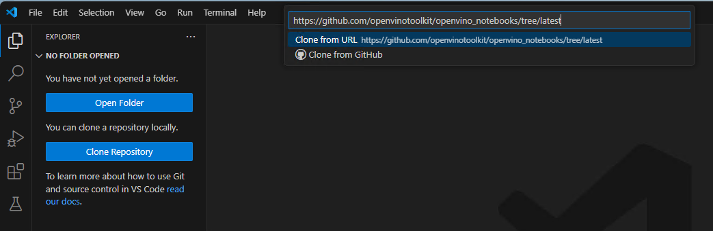

  - open the folder selection, create new folder (e.g. ov_notebooks) to download the git.

  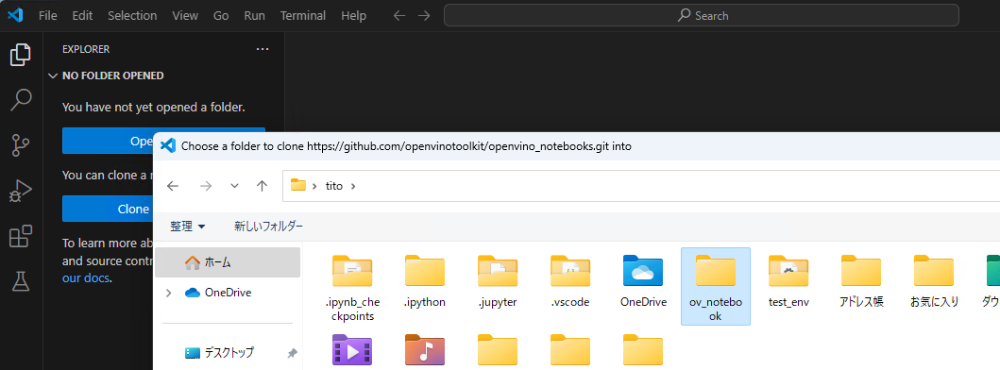

  - after install finished, open the notebook and go to "openvino-api" (notebooks->openvino-api) then open openvino-api.ipynb

  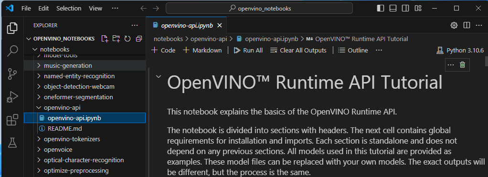

2. Setup python environment for the git repo
   
  - click current environement button upper right, then click "Select Another Kernel..."

  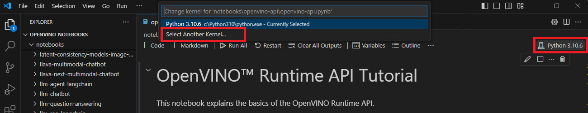

  - click "Python Envoronments.."

  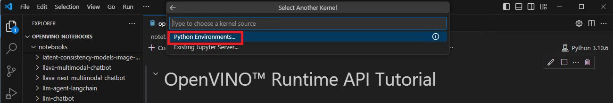

  - click "+ Create Python Envoronment"

  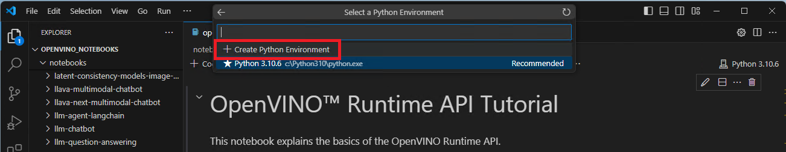

  - click "Venv .."

  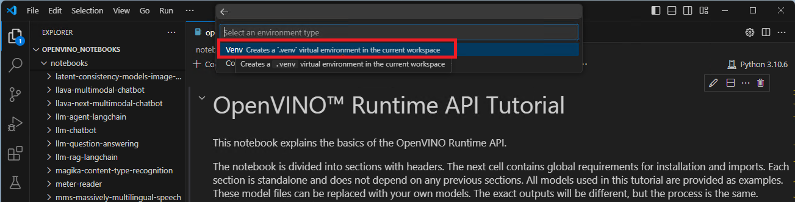

  - click current your python envonronment. 

  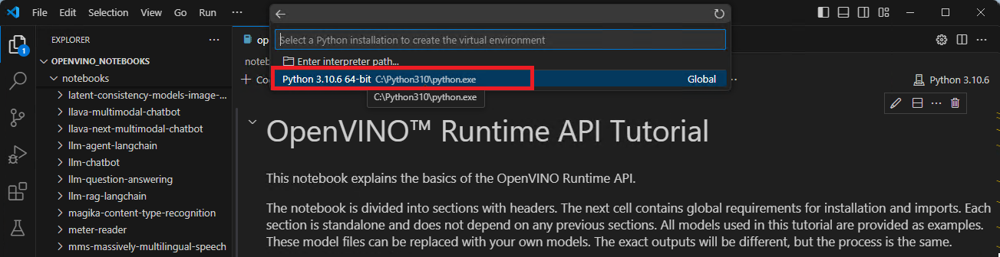

  - Cofirm current environment is ".venv"

  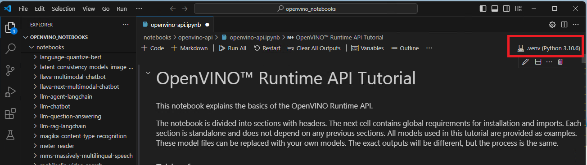

  - install required python libraries from "requirements.txt" then click "OK"

   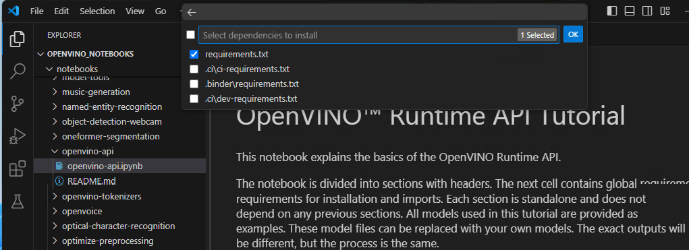

3. Update openvino library to 2024.0
  - To use NPU device, update openvino library package to 2024.0
  - Click "Terminal" on menu bar, then click "New Terminal"

  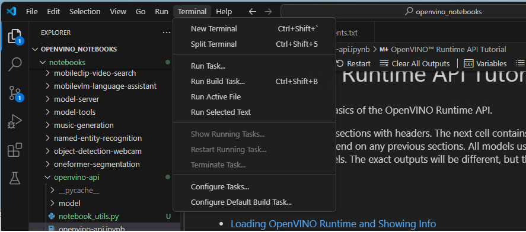

  - Terminal appears bottom of window. then type "pip install openvino==2024.0" and click enter.

  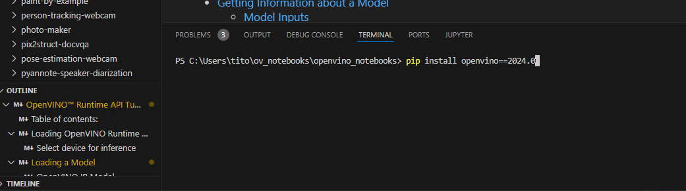

4. Now you're ready to start notebooks. Read instruction and execute each cell one by one (click execute button or Ctrl-Enter on each cell)

  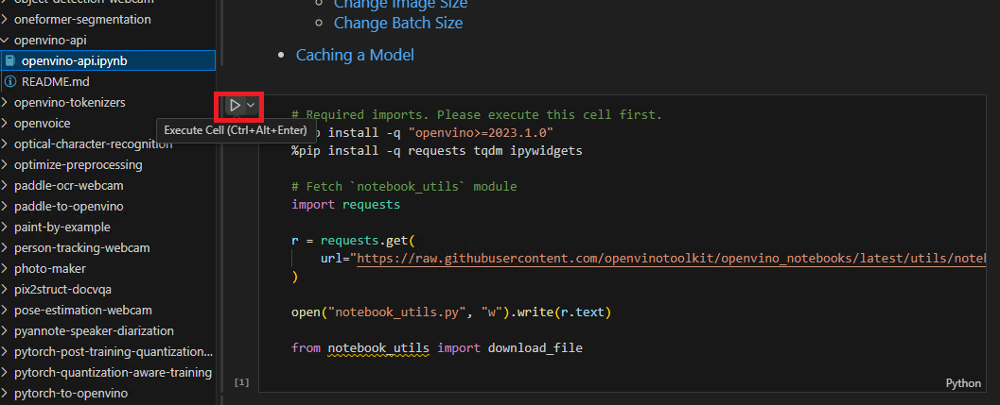

5. Once finished, please try other tutrials, also try other samples you are interested in.
   
   First steps:
    - [OpenVINO™ Runtime API Tutorial](https://github.com/openvinotoolkit/openvino_notebooks/blob/latest/notebooks/openvino-api/openvino-api.ipynb)
    - [Hello Image Classification](https://github.com/openvinotoolkit/openvino_notebooks/blob/latest/notebooks/hello-world/hello-world.ipynb)
    - [Hello Image Segmentation](https://github.com/openvinotoolkit/openvino_notebooks/blob/latest/notebooks/hello-segmentation/hello-segmentation.ipynb)
    - [Hello Object Detection](https://github.com/openvinotoolkit/openvino_notebooks/blob/latest/notebooks/hello-detection/hello-detection.ipynb)

   Here are some recommendataions you'll have fun with. 
    - [Stable Diffusion](https://github.com/openvinotoolkit/openvino_notebooks/tree/latest/notebooks/stable-diffusion-v2)
    -    
    - [Riffusion (txt to music)](https://github.com/openvinotoolkit/openvino_notebooks/tree/latest/notebooks/riffusion-text-to-music)
    -    
    - [YoLov8](https://github.com/openvinotoolkit/openvino_notebooks/tree/latest/notebooks/yolov8-optimization)
    -    
    - [LLM RAG](https://github.com/openvinotoolkit/openvino_notebooks/tree/latest/notebooks/llm-rag-langchain)
    -    
