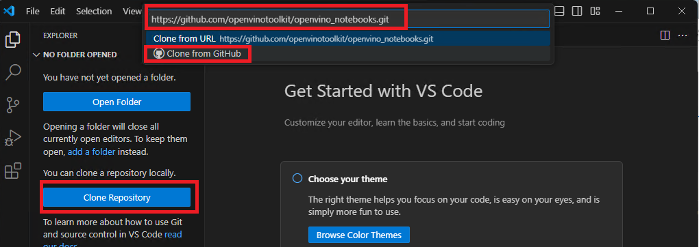

## What's this?
- Instructions how to setup OpenVINO(TM) enviornment on Microsoft VS Code on Windows PC (Intel(r) Core Ultra)
- Goal is to run [OpenVINO(TM) Notebooks](https://github.com/openvinotoolkit/openvino_notebooks/tree/latest) sample scripts with CPU/GPU/NPU on your VS code. 

## Download and install VS code. 
- https://code.visualstudio.com/

## Setup
1. Clone OpenVINO(TM) notebook from GIT.
   
  - Go to explorer, click "Clone Repository" button, input "https://github.com/openvinotoolkit/openvino_notebooks.git" then click "Clone from GitHub"
  - open the folder selection, create new folder (e.g. ov_notebooks) to download the git.
  - install required python libraries from "requirements.txt"

  

2. Update openvino library to 2024.0
  - To use NPU device, update openvino library package to 2024.0
  - Click "Terminal" on menu bar, then click "New Terminal"

  

  - Terminal appears bottom of window. then type "pip install openvino==2024.0" and click enter.

  

2. Setup python environment for the git repo
   
  - click current environement button upper right, then click "Select Another Kernel..."

  

  - click "Python Envoronments.."

  

  - click "+ Create Python Envoronment"

  

  - click "Venv .."

  

  - click current your python envonronment. 

  

  - check requirements.txt then click OK

  

  - Cofirmed current environment is ".venv"

  

