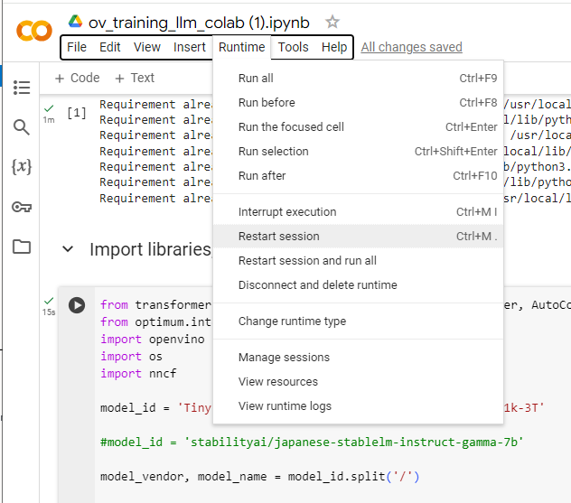
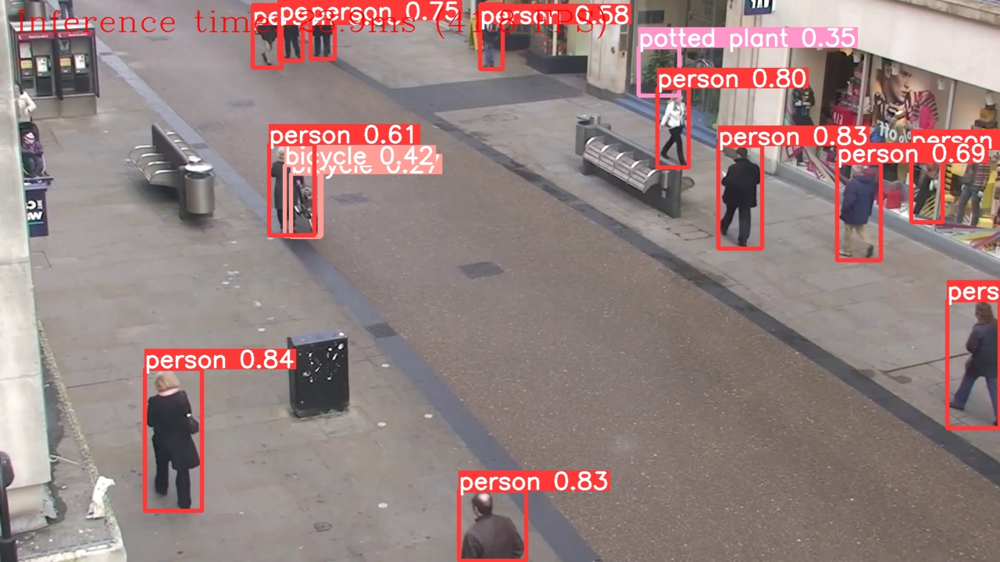
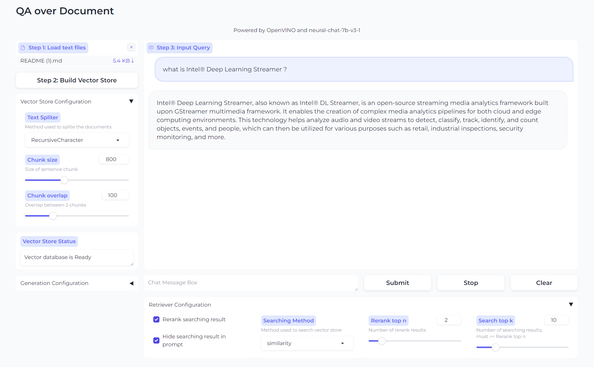

# OpenVINO-Training
1. Setup environment
   1. Windows
      1. Install Python (3.11.8)
      2. Setup Virtual Environment
      3. Install required libraries.
   4. Or you can try on Google Colab
3. Run on Jupyter Lab
4. Next steps...

## Setup environment
On this training, please setup your environemt [OpenVINO 2024.0](https://www.intel.com/content/www/us/en/developer/articles/release-notes/openvino/2024-0.html) and [Python 3.11.8](https://www.python.org/downloads/release/python-3118/) 
For running LLM models, I recommend to use Intel 12th Gen platform or later. If you don't have such system, please setup on Google Colab (instructions later). 
### System recommendation


### Windows
1. Install Python
   access to Python 3.11.8. Download [Windwos 64 installer](https://www.python.org/ftp/python/3.11.8/python-3.11.8-amd64.exe) and click to open.
   Check "Add Python.exe to Path" and "Install Now"
   

2. Setup Virtual Environment
   
   ** Details on Training: (What is Virtual Environment??) **
   
   Open comandline prompt (cmd.exe). You can confirm python 3.11.8 is installed with typing "python". (exit() for finshing python prompt)
   ```
   cd %USERPROFILE%
   python -m venv ov_env
   ov_env\Scripts\activate
   ```
   then you can see as below. When finished type "deactivate"
   

3. Download "requirements.txt" to under "ov_env" folder to install required libraries. Then type as below.

   ** Details on Training: (What is pip, libraries and requirements?) **
   
   ```
   cd %USERPROFILE%ov_env
   pip install -r requirements.txt
   ```


### On Google Colab
1. Download "ov_training_llm_colab.ipynb"
2. Go to [Googl Colab](https://colab.google/). (you need google account yourself.)
3. Click "Open Colab"
4. "Upload" -> select "ov_training_llm_colab.ipynb"

* Google Colab uses nVidia GPU which OpenVINO doesn't,. So device is set to CPU as inference engine.
* if you failed at importing optimum.intel, please "restart session" and run process again.
  


## Let's run LLM on Jupyer Lab

Let's dive into LLM local enablement process. 


This time, we use Tiny Llama, very lightweight model for time restrction, but your can apply to almost LLM models on Hugging Face with same process :)


## Next .. your turn! 

Now you'll work over 100 samples on OpenVINO(TM) Notebooks!! 
https://github.com/openvinotoolkit/openvino_notebooks

You know how to setup environment on your system. 
- you may need to install [git](https://git-scm.com/download/win) command for windows system
- or youcan download zip file from the git link directly
- 
```
python -m venv sampleenv
sampleenv\Scripts\activate
cd sampleenv
git clone https://github.com/openvinotoolkit/openvino_notebooks.git
cd openvino_notebooks-latest
pip install -r requirements.txt
```

In note books, sample scripts are listed on Jupyter Lab, try!!

Here are some recommendataions you'll have fun. 
- [Stable Diffusion](https://github.com/openvinotoolkit/openvino_notebooks/tree/latest/notebooks/stable-diffusion-v2)
-    
- [Riffusion (txt to music)](https://github.com/openvinotoolkit/openvino_notebooks/tree/latest/notebooks/riffusion-text-to-music)
-    
- [YoLov8](https://github.com/openvinotoolkit/openvino_notebooks/tree/latest/notebooks/yolov8-optimization)
-    
- [LLM RAG](https://github.com/openvinotoolkit/openvino_notebooks/tree/latest/notebooks/llm-rag-langchain)
-    


      

   
   
