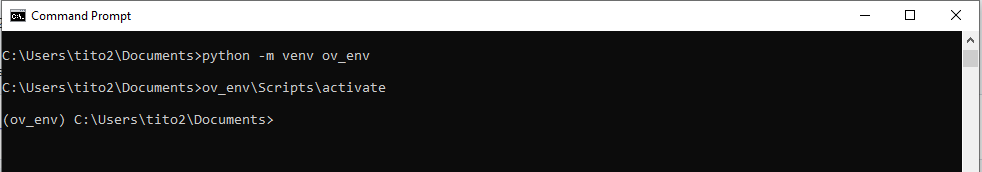

# OpenVINO-Training
1. Setup environment
   1. Windows
      1. Install Python (3.11.8)
      2. Setup Virtual Environment
      3. Install required libraries.
   4. Or you can try on Google Colab
3. Run on Jupyter Lab
4. Next steps...

## Setup environment
On this training, please setup your environemt [OpenVINO 2024.0](https://www.intel.com/content/www/us/en/developer/articles/release-notes/openvino/2024-0.html) and [Python 3.11.8](https://www.python.org/downloads/release/python-3118/) 
For running LLM models, I recommend to use Intel 12th Gen platform or later. If you don't have such system, please setup on Google Colab (instructions later). 
### System recommendation


### Windows
1. Install Python
   access to Python 3.11.8. Download [Windwos 64 installer](https://www.python.org/ftp/python/3.11.8/python-3.11.8-amd64.exe) and click to open.
   Check "Add Python.exe to Path" and "Install Now"
   

2. Setup Virtual Environment
   
   ** Details on Training: (What is Virtual Environment??) **
   
   Open comandline prompt (cmd.exe). You can confirm python 3.11.8 is installed with typing "python". (exit() for finshing python prompt)
   ```
   cd %USERPROFILE%
   python -m venv ov_env
   ov_env\Scripts\activate
   ```
   then you can see as below. When finished type "deactivate"
   

3. Download "requirements.txt" to under "ov_env" folder to install required libraries. Then type as below.

   ** Details on Training: (What is pip, libraries and requirements?) **
   
   ```
   cd %USERPROFILE%ov_env
   pip install -r requirements.txt
   ```


### On Google Colab
1. Download "ov_training_llm_colab.ipynb"
2. Go to [Googl Colab](https://colab.google/). (you need google account yourself.)
3. Click "Open Colab"
4. "Upload" -> select "ov_training_llm_colab.ipynb"

* Google Colab uses nVidia GPU which OpenVINO doesn't,. So device is set to CPU as inference engine.
* if you failed at importing optimum.intel, please "restart session" and run process again.
  


## Let's run LLM on Jupyer Lab

1. Download required package from Github
   ```
   cd %USERPROFILE%ov_env
   git clone https://github.com/Stability-AI/model-demo-notebooks.git
   ```
2. Run Jupyter Lab
   ```
   cd jslm_chatbot_demo_on_mobile_pc
   jupyter lab
   ```
3. On the jupyter notebook, please try to run all cells.
   1. import required libraries, set targeted models (stabilityai/japanese-stablelm-3b-4e1t-instruct) and device (GPU).
      ```
      from transformers import AutoModelForCausalLM, AutoTokenizer, AutoConfig, TextStreamer
      from optimum.intel import OVModelForCausalLM
      import openvino as ov
      import os
      import nncf
      
      model_id = 'stabilityai/japanese-stablelm-3b-4e1t-instruct'
      #model_id = 'meta-llama/Meta-Llama-3-8B-Instruct'
      
      model_vendor, model_name = model_id.split('/')
      device = 'GPU'
      ```
  
   2. Convert to OV Model and quantized, then save it to local
      ```
      if not os.path.exists(f'{model_name}/INT4'):
          ov_model=OVModelForCausalLM.from_pretrained(model_id, config=AutoConfig.from_pretrained(model_id, revision="model_class_update", trust_remote_code=True), revision="model_class_update", export=True, compile=False, load_in_8bit=False, trust_remote_code=True)
          compressed_model = nncf.compress_weights(ov_model.half()._original_model, mode=nncf.CompressWeightsMode.INT4_ASYM, group_size=128, ratio=0.8)
          os.makedirs(f'{model_name}/INT4')
          ov.save_model(compressed_model, f'{model_name}/INT4/openvino_model.xml')
      ```

   3. Compile the OV model
      ```
      tokenizer = AutoTokenizer.from_pretrained(model_id)

      ov_model = OVModelForCausalLM.from_pretrained(
          model_id = f'{model_name}/INT4',
          device=device,
          ov_config={"PERFORMANCE_HINT": "LATENCY", "NUM_STREAMS": "1", "CACHE_DIR": "./cache"},
          config=AutoConfig.from_pretrained(model_id)
      )
      ```

   4. Test the model
      ```
      def build_prompt(user_query, inputs="", sep="\n\n### "):
          sys_msg = "以下は、タスクを説明する指示と、文脈のある入力の組み合わせです。要求を適切に満たす応答を書きなさい。"
          p = sys_msg
          roles = ["指示", "応答"]
          msgs = [": \n" + user_query, ": "]
          if inputs:
              roles.insert(1, "入力")
              msgs.insert(1, ": \n" + inputs)
          for role, msg in zip(roles, msgs):
              p += sep + role + msg
          return p

      # Infer with prompt without any additional input
      query = input('質問をいれてください:')
      user_inputs = {
          "user_query": query,
          "inputs": ""
      }
      prompt = build_prompt(**user_inputs)
      
      print(f'** Prompt:\n{prompt}\n-------------------------')
      input_tokens = tokenizer(prompt, return_tensors='pt', add_special_tokens=False)
      streamer = TextStreamer(tokenizer, skip_prompt=True, skip_special_tokens=True)
      response = ov_model.generate(**input_tokens, 
                                   pad_token_id=tokenizer.eos_token_id,
                                   eos_token_id=tokenizer.eos_token_id,
                                   max_new_tokens=300,
                                   num_return_sequences=1,
                                   temperature=1.0,
                                   do_sample=True,
                                   top_k=5,
                                   top_p=0.90,
                                   repetition_penalty=1.2,
                                   streamer=streamer)

      ```


      

   
   
