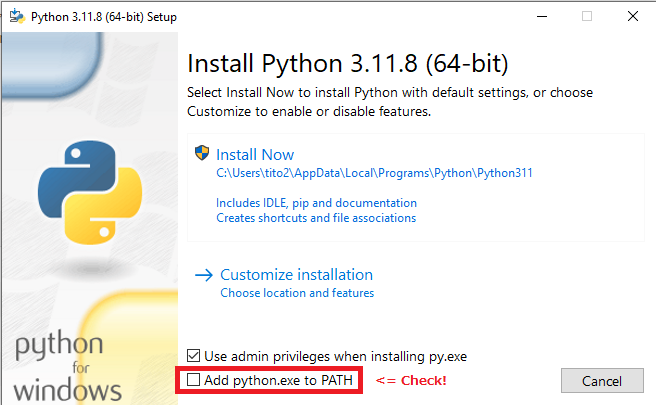

# OpenVINO-Training
1. Setup environment
   1. Windows
      1. Install Python (3.11.8)
      2. Setup Virtual Environment
      3. Install required libraries.
   3. MAC OS
   4. Or on Google Colab
3. Run on Jupyter Lab
4. Next steps...

## Setup environment
On this training, please setup your environemt [OpenVINO 2024.0](https://www.intel.com/content/www/us/en/developer/articles/release-notes/openvino/2024-0.html) and [Python 3.11.8](https://www.python.org/downloads/release/python-3118/) 
For running LLM models, I recommend to use Intel 12th Gen platform or later. If you don't have such system, please setup on Google Colab (instructions later). 
### System recommendation


### Windows
1. Install Python
   access to Python 3.11.8. Download [Windwos 64 installer](https://www.python.org/ftp/python/3.11.8/python-3.11.8-amd64.exe) and click to open.
   Check "Add Python.exe to Path" and "Install Now"
   

2. Setup Virtual Environment
   
   (What is Virtual Environment??) <= under constructing...
   
   Open comandline prompt (cmd.exe). You can confirm python 3.11.8 is installed with typing "python". (exit() for finshing python prompt)
   ```
   cd %USERPROFILE%
   python -m venv ov_env
   ov_env\Scripts\activate
   ```
   then you can see as below. When finished type "deactivate"
   

3. Download "requirements.txt" to under "ov_env" folder to install required libraries. Then type as below.

   (What is pip, libraries and requirements?) <= under constructing..
   
   ```
   cd %USERPROFILE%ov_env
   pip install -r requirements.txt
   ```

   Type "pip list" then you should see as below
   ```
   Listing libraries <= 
   ```

### Mac OS
To be added
### On Google Colab
To be added


## Let's run LLM on Jupyer Lab

1. Download required package from Github
   ```
   cd %USERPROFILE%ov_env
   git clone https://github.com/Stability-AI/model-demo-notebooks.git
   ```
2. Run Jupyter Lab
   ```
   cd jslm_chatbot_demo_on_mobile_pc
   jupyter lab
   ```
3. On the jupyter notebook, please try to run all cells.
   1. import required libraries, set targeted models (stabilityai/japanese-stablelm-3b-4e1t-instruct) and device (GPU).
      ```
      from transformers import AutoModelForCausalLM, AutoTokenizer, AutoConfig, TextStreamer
      from optimum.intel import OVModelForCausalLM
      import openvino as ov
      import os
      import nncf
      
      model_id = 'stabilityai/japanese-stablelm-3b-4e1t-instruct'
      #model_id = 'meta-llama/Meta-Llama-3-8B-Instruct'
      
      model_vendor, model_name = model_id.split('/')
      device = 'GPU'
      ```
  
   2. Convert to OV Model and quantized, then save it to local
      ```
      if not os.path.exists(f'{model_name}/INT4'):
          ov_model=OVModelForCausalLM.from_pretrained(model_id, config=AutoConfig.from_pretrained(model_id, revision="model_class_update", trust_remote_code=True), revision="model_class_update", export=True, compile=False, load_in_8bit=False, trust_remote_code=True)
          compressed_model = nncf.compress_weights(ov_model.half()._original_model, mode=nncf.CompressWeightsMode.INT4_ASYM, group_size=128, ratio=0.8)
          os.makedirs(f'{model_name}/INT4')
          ov.save_model(compressed_model, f'{model_name}/INT4/openvino_model.xml')
      ```
      

   
   
