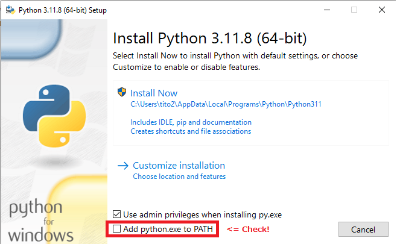
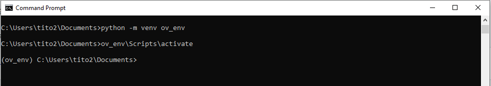

## What this?
- Instructions how to setup OpenVINO(TM) enviornment on Windows PC (Intel(r) Core Ultra)
- Goal is to run OpenVINO(TM) Notebooks sample scripts with CPU/GPU/NPU on your PC

## First to do when you get PC
- please update GPU and CPU driver
- https://www.intel.co.jp/content/www/jp/ja/products/details/processors/core-ultra/downloads.html
  - インテル® Arc™ & Iris® Xe Graphics - Windows*
  - インテル® NPU ドライバー - Windows*
- Also run Windows Update
  - 設定　-> アップデート＆セキュリティ -> Windows Update から更新
 
## Setup

1. Install Python
   access to Python 3.11.8. Download [Windwos 64 installer](https://www.python.org/ftp/python/3.11.8/python-3.11.8-amd64.exe) and click to open.
   Check "Add Python.exe to Path" and "Install Now"
   
   

3. Setup Virtual Environment
   
   Open comandline prompt (cmd.exe). You can confirm python 3.11.8 is installed with typing "python". (exit() for finshing python prompt)
   
   ```
   cd %USERPROFILE%
   python -m venv ov_env
   ov_env\Scripts\activate
   ```
   
   then you can see as below. When finished type "deactivate"
   

5. Install GIT command for Windows.
   Download and install for Win-64bit 
   https://git-scm.com/download/win

6. Download openvino_notebooks with GIT command

    ```
    cd ov_env
    git clone https://github.com/openvinotoolkit/openvino_notebooks.git
    cd openvino_notebooks
    ```

5. install required python libraries on your virtual environment.
   
    ```
    pip install -r requirements.txt
    ```

6. go to first folders and run jupyter.
   
   ```
   cd notebooks
   jupyter lab
   ```

8. Once open Jupyter Lab on your browser, move to "OpenVINO™ Runtime API Tutorial"
   click "openvino-api" folder and open "openvino-api.ipynb" on left plain.
   
   

10. Read instruction and run each cell one by one (click run button or Ctrl-Enter on each cell)

11. Once finished, please try other tutrials, also try other samples you are interested in. 

How to uninstall？
  - Just remove folders.
  - Uninstall python and git from Windows settings if necessary 
